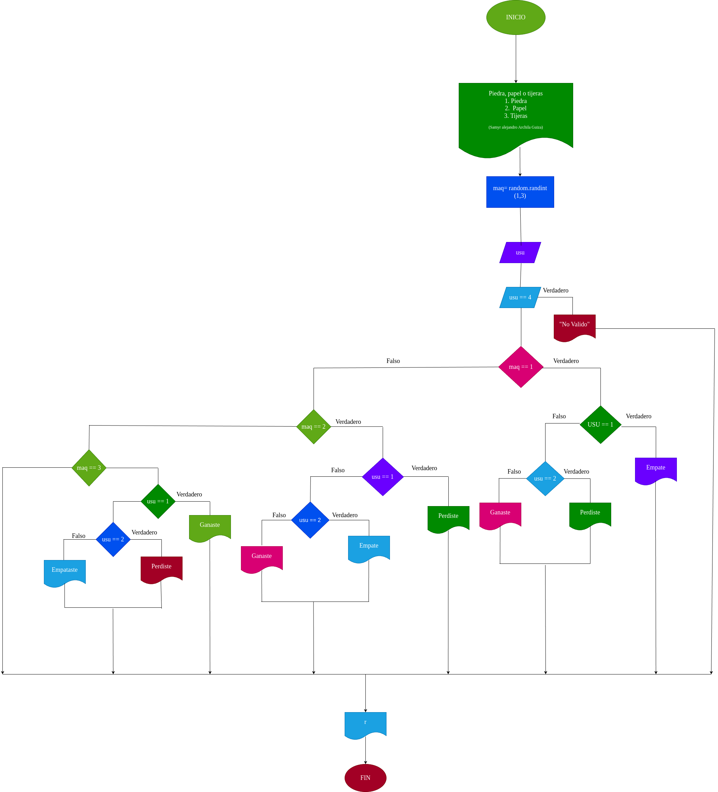

# piedra_papel_tijeras

crear un juego que seria piedra papel o tijera

# Analisis

# Input

### Variables de entrada

usu: eleccion realizada por el usuario

### Prossesing

usu: Determina la decision del usuario

Operaciones Disponibles

1) Piedra

2) Papel

3) Tijera

Si usu no es valido, el resultado sera "No valido"

### output

usu: Determina la decision del usuario

maq: Determina la decision de la maquina

# Diseño

# Construcción
